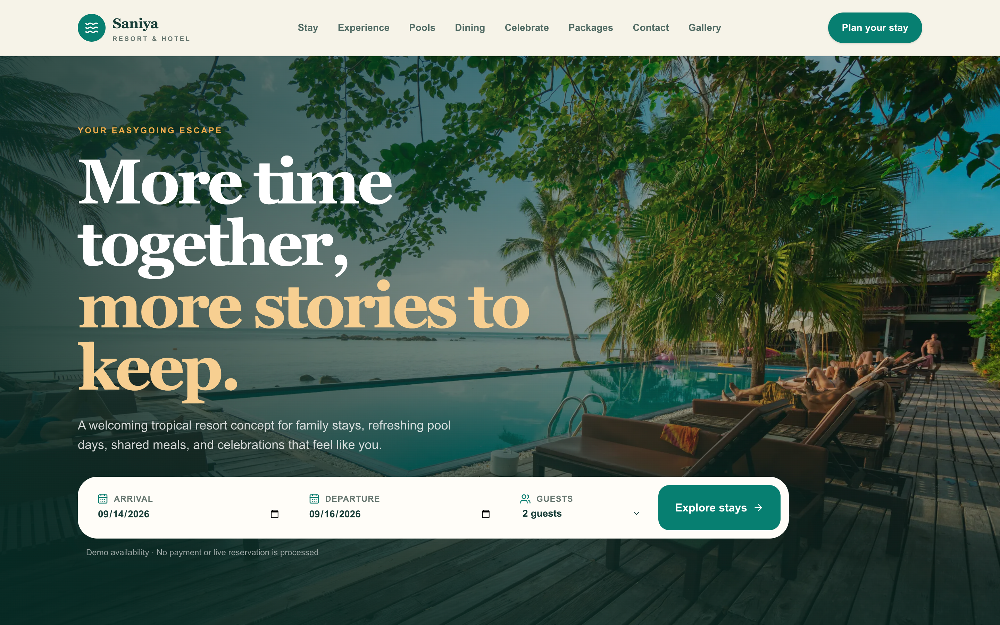
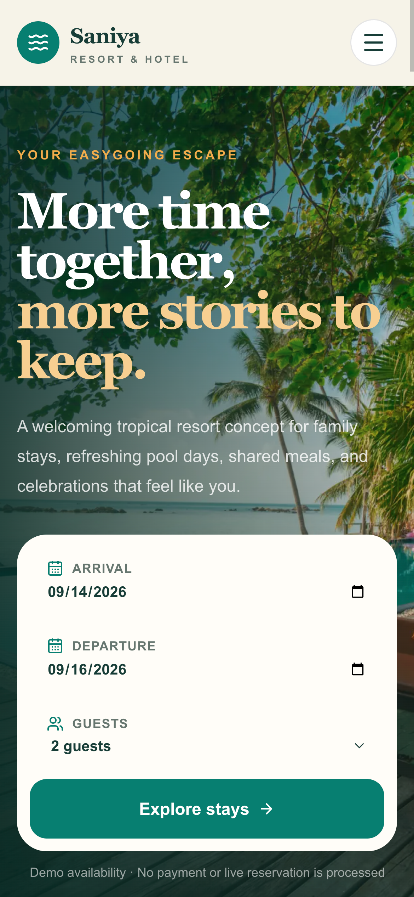
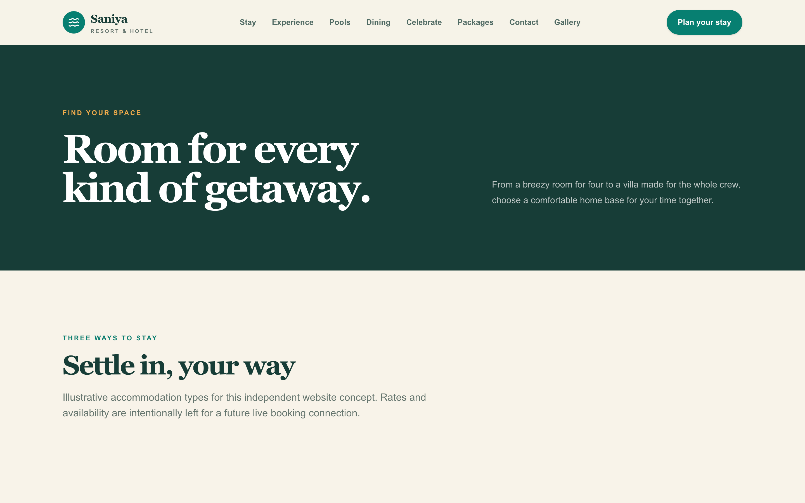
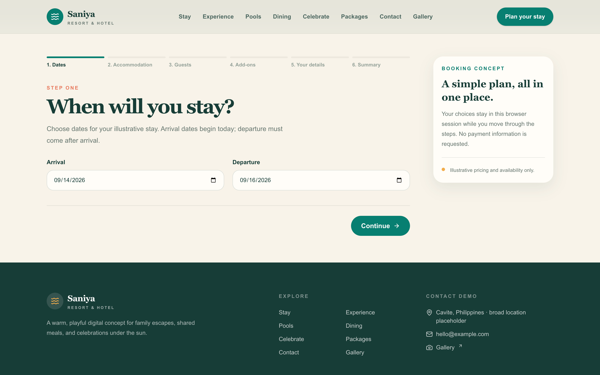
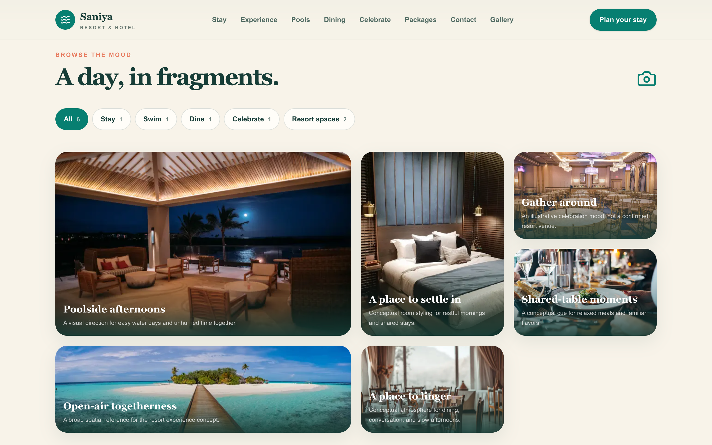

# Saniya Resort & Hotel

## Independent Website Concept / Digital Experience Redesign



> **Independent website concept created as a web-development portfolio project. This project is not affiliated with, commissioned by, or endorsed by Saniya Resort & Hotel.**

## Project overview

Hospitality websites need to help people move from inspiration to confident planning: understand the stay, compare accommodation options, explore experiences, and take the next step without friction. This concept explores that commercial design problem through a clear, editorial frontend experience for a tropical resort brand direction.

The project is a frontend hospitality experience built for portfolio demonstration. It uses typed mock content, illustrative pricing, and conceptual photography to demonstrate information architecture, responsive UI, interaction design, forms, and a realistic booking journey. It does not make factual claims about the real resort or represent a client engagement.

## Live demo

[Open the deployed concept](https://saniya-resort-concept.vercel.app)

## Key features

- Responsive hospitality homepage
- Accommodations catalogue and detail pages
- Facilities and pools experiences
- Dining and celebrations
- Packages and conceptual pricing
- Gallery filtering
- Contact and event forms
- Multi-step mock booking flow
- Accessible interaction states
- SEO and performance implementation
- Clear conceptual-content disclosures

## Booking flow

The booking experience demonstrates the complete planning sequence:

**Choose Dates** → **Choose Accommodation** → **Select Guests** → **Add-ons** → **Guest Details** → **Summary** → **Demo Confirmation**

The flow validates dates, guest counts, accommodation capacity, contact details, and the demonstration acknowledgement. It creates only a local demo reference in the browser. No payment, reservation, email, or backend operation occurs.

## Screenshot showcase

<p align="center">
  
  
</p>

<p align="center">
  
  
</p>

## Technical stack

- Next.js App Router
- TypeScript
- Tailwind CSS
- Framer Motion
- React Hook Form
- Zod
- date-fns
- Lucide React
- Next/Image
- Vercel

## Architecture

- Server Components by default, with Client Components where interaction requires browser state.
- Typed mock-data modules for accommodations, facilities, pools, dining, events, packages, gallery content, and booking options.
- Reusable layout and UI components for navigation, footer, headings, reveals, cards, forms, and booking steps.
- Route-based application structure with dedicated pages for each hospitality experience and dynamic accommodation detail routes.
- Form schemas and validation built with React Hook Form and Zod.
- Static frontend demonstration with no backend, live inventory, reservation system, or payment processing.

### Main routes

`/` · `/accommodations` · `/accommodations/[id]` · `/facilities` · `/pools` · `/dining` · `/events` · `/packages` · `/gallery` · `/contact` · `/booking`

## Accessibility and quality

The implementation includes semantic HTML, keyboard navigation, visible keyboard and focus states, screen-reader-friendly validation, reduced-motion support, and responsive image optimization through `next/image`.

Lighthouse results collected from the deployed homepage:

| Category | Result |
| --- | ---: |
| Performance | 100 |
| Accessibility | 96 |
| Best Practices | 100 |
| SEO | 100 |

Results may vary by environment.

## Project structure

```text
src/
├── app/
│   ├── accommodations/[id]/
│   ├── accommodations/
│   ├── booking/
│   ├── contact/
│   ├── dining/
│   ├── events/
│   ├── facilities/
│   ├── gallery/
│   ├── packages/
│   ├── pools/
│   ├── layout.tsx
│   └── page.tsx
├── components/
│   ├── booking/
│   ├── contact/
│   ├── events/
│   ├── gallery/
│   ├── layout/
│   ├── packages/
│   └── ui/
├── data/
├── lib/
└── types/
docs/
└── screenshots/
```

## Local development

```bash
git clone https://github.com/Gio6076/saniya-resort-concept.git
cd saniya-resort-concept
npm install
npm run dev
```

Open the local development URL shown by Next.js. Run the quality checks with:

```bash
npm run lint
npx tsc --noEmit
npm run build
```

## Deployment

The project is deployed through Vercel from the GitHub repository. The live deployment is available at [saniya-resort-concept.vercel.app](https://saniya-resort-concept.vercel.app).

## Future improvements

- Approved resort photography and verified business information
- Real inventory and availability
- Secure backend reservation management
- Payment integration
- CMS-managed content
- Production email notifications
- Analytics and monitoring

## Author

Concept design and development by **Giovani Paulo R. Ebarola**.

- GitHub: https://github.com/Gio6076

Giovani created the independent website concept and implementation. No affiliation, commission, or endorsement by Saniya Resort & Hotel is implied. This authorship does not claim ownership over the referenced business identity, name, trademarks, original logo, properties, services, products, projects, or public materials. Existing asset attribution and licensing requirements remain valid.
